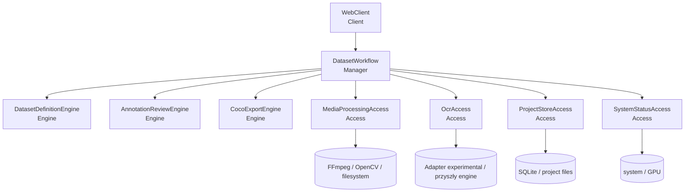
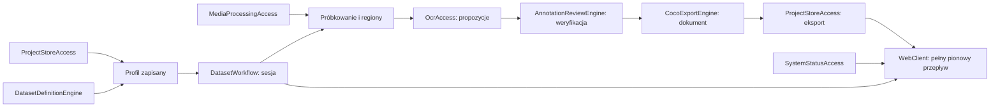

# Dekompozycja Systemu

> Punkt 3 strategii Pragmatycznej. Moduły wynikają z niezależnych osi
> zmienności, nie z tabel bazy ani pojedynczych ekranów.

## Moduły

| Nazwa | Warstwa | Typ zmienności | Odpowiedzialność i uzasadnienie |
|-------|---------|----------------|---------------------------------|
| `WebClient` | Client | Infrastrukturalna | Widoki React, routing, formularze, wygenerowany klient HTTP i wizualizacja boksów. UI może zmieniać się niezależnie i nie zawiera reguł datasetu. Cienkie route handlery FastAPI są adapterem wejściowym publicznego API managera, nie osobnym modułem domenowym. |
| `DatasetWorkflow` | Manager | Procesowa | Orkiestruje pionowy przepływ: profil → materiał → pipeline → weryfikacja → eksport oraz udostępnia stan do pollingu. To jeden workflow, więc nie rozbijamy go na wiele managerów. |
| `DatasetDefinitionEngine` | Engine | Biznesowa | Czyste reguły profilu gry, regionów względnych/pikselowych, klas znaków i mapowania wykryć na anotacje. Zmienia się wraz z polityką datasetu. |
| `AnnotationReviewEngine` | Engine | Biznesowa | Czyste przejścia stanu anotacji: propozycja, korekta klasy, geometria boksu — nowego i istniejącego, usunięcie boksu, akceptacja/odrzucenie klatki oraz ponowne otwarcie odrzuconej. Oddzielone od OCR i UI, bo zasady weryfikacji mogą ewoluować niezależnie. |
| `CocoExportEngine` | Engine | Format danych | Buduje i waliduje dokument COCO z zaakceptowanych klatek, bez zapisu na dysk. Osobny moduł ogranicza przyszłą podmianę/dodanie formatu eksportu. |
| `MediaProcessingAccess` | Access | Infrastrukturalna | Ukrywa FFmpeg i OpenCV: metadane wideo, próbkowanie 1 fps, zapis klatek i wycinanie regionów HUD. Narzędzia można podmienić bez zmiany workflow. |
| `OcrAccess` | Access | Infrastrukturalna | Kontrakt `OcrEngine` i wymienialne adaptery zwracające znaki, boksy, confidence i provenance. Tesseract jest adapterem experimental, nie zatwierdzonym wyborem produkcyjnym. |
| `ProjectStoreAccess` | Access | Infrastrukturalna | Repozytoria SQLAlchemy/Alembic dla SQLite oraz kontrolowany zapis plików projektu i eksportu. Ukrywa trwałość przed logiką. |
| `SystemStatusAccess` | Access | Infrastrukturalna | Odczytuje dostępność FFmpeg/Tesseract, ścieżki robocze oraz stan GPU prezentowany na dashboardzie. Nie uruchamia SAM 3 w v1. |

## Decyzje o granularności

- Jeden `DatasetWorkflow` zamiast managera per etap: etapy zawsze składają się
  w ten sam pionowy proces, a synchroniczne manager→manager złamałoby zasady
  strategii.
- Profil gry i mapowanie klas pozostają razem w `DatasetDefinitionEngine`, bo
  wspólnie definiują znaczenie regionów i dozwolonych anotacji.
- FFmpeg i OpenCV są jednym `MediaProcessingAccess`, ponieważ dla v1 wspólnie
  realizują pobranie klatki i przygotowanie cropu; ich sztuczne rozdzielenie
  zwiększyłoby koszt integracji.
- Serializacja COCO jest czysta (`CocoExportEngine`), natomiast fizyczny zapis
  pliku należy do `ProjectStoreAccess`.
- SAM 3, ręczne boksy ikon, edycja profili, auth, chmura, broker wiadomości i
  plugin system są jawnie poza v1 i nie dostają modułów „na zapas”.

## Pokrycie funkcjonalności v1

| Funkcjonalności | Moduły prowadzące |
|-----------------|-------------------|
| F01, F07 | `DatasetDefinitionEngine`, `DatasetWorkflow`, `ProjectStoreAccess` |
| F03, F04, F05, F13 | `DatasetWorkflow`, `MediaProcessingAccess`, `ProjectStoreAccess` |
| F06 | `OcrAccess`, `DatasetDefinitionEngine`, `DatasetWorkflow` |
| F08 | `AnnotationReviewEngine`, `DatasetWorkflow`, `WebClient` |
| F11 | `CocoExportEngine`, `ProjectStoreAccess`, `DatasetWorkflow` |
| F12, F14 | `SystemStatusAccess`, `DatasetWorkflow`, `WebClient` |
| F15 | `ProjectStoreAccess` |
| F16 | `WebClient` |

## Diagram Warstw

## Klasyfikacja IDesign

- **Client (1):** `WebClient` jest punktem interakcji użytkownika i wyłącznie
  wywołuje kontrakt HTTP managera oraz renderuje odpowiedź.
- **Manager (1):** `DatasetWorkflow` koordynuje scenariusze i niższe moduły;
  brak drugiego managera eliminuje synchroniczne Manager↔Manager.
- **Engine (3):** moduły definicji, weryfikacji i COCO są deterministyczne,
  testowalne bez HTTP, bazy, filesystemu i procesów zewnętrznych.
- **Access (4):** media, OCR, persistence i status ukrywają fizyczne zasoby.
- **Utility (0):** logger i konfiguracja pozostają małymi współdzielonymi
  pomocnikami, ale nie tworzymy dla nich przedwcześnie modułu.

## Zasady Komunikacji — potwierdzenie

- [x] Komunikacja tylko w dół: Client → Manager → Engine / Access.
- [x] Manager↔Manager: nie występuje, ponieważ istnieje jeden manager.
- [x] Engine nie zależy od SQLite, HTTP, filesystemu, FFmpeg ani Tesseract.
- [x] Client nie zawiera reguł profilu, pipeline'u, anotacji ani COCO.
- [x] Access nie wywołuje Managera; zwraca jawne wyniki lub kontrolowane błędy.
- [x] Tesseract jest niezaufanym wejściem: adapter parsuje wynik, engine waliduje
  geometrię/klasy, a zapis następuje dopiero przez workflow i po weryfikacji.

## Zależności i momenty integracji

Momenty integracji:

1. `ProjectStoreAccess` + `DatasetDefinitionEngine` — profil gry można utworzyć
   i ponownie odczytać.
2. `DatasetWorkflow` + `MediaProcessingAccess` — materiał przechodzi do klatek
   oraz cropów HUD z trwałym stanem progresu.
3. `OcrAccess` + `DatasetDefinitionEngine` — surowe boksy Tesseract są
   walidowanymi propozycjami klas.
4. `AnnotationReviewEngine` + `DatasetWorkflow` — propozycje stają się
   zaakceptowanymi albo odrzuconymi anotacjami.
5. `CocoExportEngine` + `ProjectStoreAccess` — zaakceptowany stan daje poprawny,
   zapisany `annotations.json`.
6. `WebClient` + publiczne API `DatasetWorkflow` — cały pionowy przepływ jest
   obsługiwalny z interfejsu Impeccable.

## Ścieżka Krytyczna

Ścieżka krytyczna integracji prowadzi przez:

`ProjectStoreAccess` + `DatasetDefinitionEngine` → `DatasetWorkflow` →
`MediaProcessingAccess` → `OcrAccess` → `AnnotationReviewEngine` →
`CocoExportEngine` → `WebClient`.

`SystemStatusAccess` nie leży na ścieżce krytycznej i może zostać dołączony do
dashboardu po uruchomieniu głównego przepływu. Przy jednym wykonawcy wszystkie
moduły nadal obciążają ten sam zasób, więc sumaryczny czas osobodni obejmuje
cały zakres, nawet jeśli część zależności technicznie pozwala na równoległość.

## Estymacje PERT

Jednostka: dzień pracy jednej osoby. `PERT = (O + 4M + P) / 6`.

| Moduł | O | M | P | PERT | Na ścieżce krytycznej? |
|-------|---:|---:|---:|-----:|-------------------------|
| `ProjectStoreAccess` | 1 | 2 | 4 | 2.2 | Tak |
| `MediaProcessingAccess` | 2 | 4 | 8 | 4.3 | Tak |
| `OcrAccess` | 2 | 5 | 12 | 5.7 | Tak — największe ryzyko techniczne |
| `SystemStatusAccess` | 0.5 | 1 | 2 | 1.1 | Nie |
| `DatasetDefinitionEngine` | 1 | 2 | 4 | 2.2 | Tak |
| `AnnotationReviewEngine` | 1 | 2 | 4 | 2.2 | Tak |
| `CocoExportEngine` | 0.5 | 1.5 | 3 | 1.6 | Tak |
| `DatasetWorkflow` | 2 | 4 | 8 | 4.3 | Tak |
| `WebClient` | 3 | 6 | 12 | 6.5 | Tak |

## Kolejność Implementacji

1. `ProjectStoreAccess` + kontrakty domenowe — baza i filesystem jako
   fundament, wraz z migracją oraz testem pełnego wiringu aplikacji.
2. `DatasetDefinitionEngine` — profile, regiony i klasy na czystych testach.
3. `MediaProcessingAccess` — realny FFmpeg/OpenCV i fixture krótkiego wideo.
4. `OcrAccess` — stabilny kontrakt i adapter experimental; docelowy engine jest
   TD-014 i nie może wymagać zmian w workflow/engine mapping.
5. `DatasetWorkflow` — integracja profilu, importu, próbkowania i OCR z
   trwałym stanem i pollingiem; manager powstaje pionowymi kawałkami.
6. `AnnotationReviewEngine` — korekty, usunięcia, akceptacja/odrzucenie oraz
   integracja z workflow.
7. `CocoExportEngine` — walidowany dokument COCO i zapis przez store.
8. `WebClient` — najpierw powłoka Impeccable, potem obsługa kompletnego API;
   końcowy klient pozostaje cienki.
9. `SystemStatusAccess` — kontrola wymagań i stan GPU do dashboardu; dołączony
   przed końcową weryfikacją, lecz poza ścieżką krytyczną.

## Sumaryczny Czas

- Optymistyczny: **13 osobodni**.
- Najbardziej prawdopodobny: **27.5 osobodnia**.
- PERT: **30 osobodni**.
- Pesymistyczny: **57 osobodni**.
- Budżet P3: **miesiące** — plan mieści się w budżecie; główną zmienną jest
  jakość Tesseract na stylizowanych fontach HUD, nie objętość CRUD/UI.
