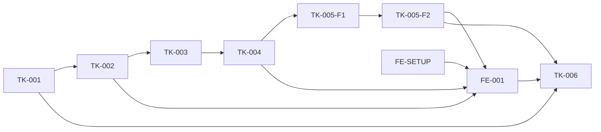

# DatasetFactory MVP — indeks ticketów

| ID | Tytuł | Status | Zależności | Gate |
|----|-------|--------|-------------|------|
| TK-001 | Fundament aplikacji i trwały workspace | wykonany | — | Gate 1 backend ✓ |
| FE-SETUP | Bootstrap systemu designu Impeccable | wykonany warunkowo | — | Gate 1; screenshot odroczony do Gate 3 |
| TK-002 | Profil gry i import lokalnego materiału | wykonany | TK-001 | Gate TK-002 ✓ |
| TK-003 | Media i eksperymentalny adapter OCR | wykonany | TK-001, TK-002 | Gate 2 techniczny ✓; quality FAIL→TD-014 |
| TK-004 | Trwały workflow, checkpointy i odzyskiwanie | wykonany | TK-003-F2 | Zintegrowany w `d4069bb`; finalny review `ACCEPT` |
| TK-005 | Weryfikacja anotacji i eksport COCO | wykonany (F1+F2) | TK-004 | Gate 3 backend ✓; pełny Gate 3 czeka na FE-001 |
| TK-005-F1 | Weryfikacja anotacji i licznik rewizji | wykonany | TK-004 | część Gate 3 ✓ |
| TK-005-F2 | Eksport COCO na snapshocie rewizji | wykonany | TK-005-F1 | Gate 3 backend ✓ |
| TK-005-F2-FIX1 | Rekoncyliacja przerwanych eksportów przy starcie | wykonany | TK-005-F2 | cold review High ✓; suite 235/235 |
| FE-001 | Pionowy interfejs Home — Impeccable | gotowy | FE-SETUP, TK-002, TK-004, TK-005 | Gate 3 |
| TK-006 | E2E, hardening i uruchomienie jedną komendą | gotowy | wszystkie powyższe | Gate 4 |

Fixup `TK-001-F1` wykonany i ponownie zweryfikowany: 25/25 testów backendu,
15/15 frontendu, pełny lint/typecheck/build/audit bez ostrzeżeń.

Fixupy `TK-002-F1` i `TK-002-F2` wykonane; końcowy niezależny review zamknął
wszystkie findings. Pełny suite wykonawcy: 72/72; final targeted review: 18/18.

Rewizja OCR oraz `TK-003-F1/F2` wykonane: wydzielony `OcrEngine`, klasa `/`,
Tesseract wyłącznie jako adapter experimental, pinowane provenance, confinement,
model/language binding, `ocr-evaluator-v2` i manifest GT+cropów. Quality pozostaje
oczekiwanym FAIL, a docelowy engine pozostaje TD-014. TK-004 jest odblokowany,
ale musi przenosić `experimental=true` i `quality_gate=failed`.

`TK-005-F1` wykonany (`559acef`) wraz z fixupem `TK-005-F1-FIX1` (`24ee3d2`),
który rozdzielił ostrzeżenie recovery od provenance OCR po findingu High z cold
review. Niezależne re-review: `ACCEPT`. Pełny suite 221/221.

`TK-005-F2` wykonany (`7f53b23`) wraz z fixupem `TK-005-F2-FIX1` (`b73103c`).
Cold review zgłosił jeden finding High: śmierć procesu po commicie snapshotu
osierocała rekord `exports` w stanie `running`, a partial unique index blokował
wtedy każdy kolejny eksport runu bezterminowo. Naprawione idempotentną
rekoncyliacją startową w `access/store/reconciliation.py`, kod `export_process_
interrupted`; eksport `completed` jest nietykalny. Re-review: `ACCEPT` bez
findingów. Pełny suite 235/235.

TK-005 został rozbity na dwa sub-tickety. `TK-005-F1` wnosi migrację `0005`
(`review_revision`, `exports.error_code`, partial unique index eksportu), więc
`TK-005-F2` bez niego nie startuje. Kontrakt obu jest przypięty w `TECH_PLAN`
commitem `63fa715`. Rozstrzygnięcie recovery: klatka z decyzją review jest
nietykalna dla rekoncyliacji, zgodnie z CF-04.

## Graf zależności

TK-001 i FE-SETUP mogą powstać równolegle. Dalsza ścieżka backendowa jest
sekwencyjna; FE-001 zaczyna integrację po stabilizacji kontraktów.
