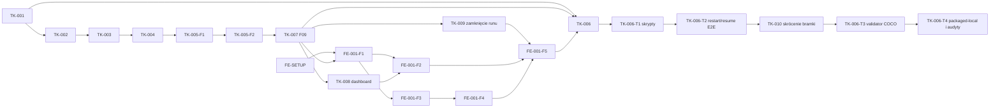

# DatasetFactory MVP — indeks ticketów

| ID | Tytuł | Status | Zależności | Gate |
|----|-------|--------|-------------|------|
| TK-001 | Fundament aplikacji i trwały workspace | wykonany | — | Gate 1 backend ✓ |
| FE-SETUP | Bootstrap systemu designu Impeccable | wykonany warunkowo | — | Gate 1; screenshot odroczony do Gate 3 |
| TK-002 | Profil gry i import lokalnego materiału | wykonany | TK-001 | Gate TK-002 ✓ |
| TK-003 | Media i eksperymentalny adapter OCR | wykonany | TK-001, TK-002 | Gate 2 techniczny ✓; quality FAIL→TD-014 |
| TK-004 | Trwały workflow, checkpointy i odzyskiwanie | wykonany | TK-003-F2 | Zintegrowany w `d4069bb`; finalny review `ACCEPT` |
| TK-005 | Weryfikacja anotacji i eksport COCO | wykonany (F1+F2) | TK-004 | Gate 3 backend ✓; pełny Gate 3 czeka na FE-001 |
| TK-005-F1 | Weryfikacja anotacji i licznik rewizji | wykonany | TK-004 | część Gate 3 ✓ |
| TK-005-F2 | Eksport COCO na snapshocie rewizji | wykonany | TK-005-F1 | Gate 3 backend ✓ |
| TK-005-F2-FIX1 | Rekoncyliacja przerwanych eksportów przy starcie | wykonany | TK-005-F2 | cold review High ✓; suite 235/235 |
| TK-007 | Ręczne boksy i ponowne otwarcie klatki (F09) | wykonany | TK-005 | część Gate 3 ✓ |
| FE-001 | Pionowy interfejs Home — Impeccable | wykonany | FE-SETUP, TK-002, TK-004, TK-005, TK-007 | Gate 3 ✓ |
| FE-001-F1 | Fundament: klient API, routing i powłoka | wykonany | FE-SETUP, TK-007 | część Gate 3 ✓ |
| TK-008 | Endpoint dashboardu (F12) | wykonany | TK-005, TK-007 | odblokowuje FE-001-F2 |
| FE-001-F2 | Materiały, uruchomienie runu i dashboard | wykonany | FE-001-F1, TK-008 | część Gate 3 ✓ |
| FE-001-F3 | Profil gry i rysowanie regionów HUD | wykonany | FE-001-F1 | część Gate 3 ✓ |
| FE-001-F4 | Ekran weryfikacji anotacji | wykonany | FE-001-F1, FE-001-F3 | część Gate 3 ✓ |
| TK-009 | Zamknięcie runu po eksporcie | wykonany | TK-005, TK-008 | odblokowuje FE-001-F5 |
| FE-001-F5 | Eksport i bramki Gate 3 UI | wykonany | FE-001-F1…F4, TK-009 | Gate 3 UI ✓ |
| TK-006 | E2E, hardening i uruchomienie jedną komendą | rozbity na T1–T4 | wszystkie powyższe | Gate 4 |
| TK-006-T1 | Skrypty uruchomieniowe, jedna bramka i dokumentacja | wykonany | FE-001 | część Gate 4 ✓ |
| TK-006-T2 | Restart, resume i pełna ścieżka review w E2E | wykonany | TK-006-T1 | część Gate 4 ✓ |
| TK-006-T3 | Validator COCO, realny Tesseract i zapis zależności | do zrobienia | TK-006-T2 | część Gate 4 |
| TK-006-T4 | Packaged-local bez binarki OCR i audyty domykające | do zrobienia | TK-006-T3 | Gate 4 |
| TK-010 | Skrócenie backendowej bramki testowej | do zrobienia | TK-006-T2 | przed TK-006-T3 |

Fixup `TK-001-F1` wykonany i ponownie zweryfikowany: 25/25 testów backendu,
15/15 frontendu, pełny lint/typecheck/build/audit bez ostrzeżeń.

Fixupy `TK-002-F1` i `TK-002-F2` wykonane; końcowy niezależny review zamknął
wszystkie findings. Pełny suite wykonawcy: 72/72; final targeted review: 18/18.

Rewizja OCR oraz `TK-003-F1/F2` wykonane: wydzielony `OcrEngine`, klasa `/`,
Tesseract wyłącznie jako adapter experimental, pinowane provenance, confinement,
model/language binding, `ocr-evaluator-v2` i manifest GT+cropów. Quality pozostaje
oczekiwanym FAIL, a docelowy engine pozostaje TD-014. TK-004 jest odblokowany,
ale musi przenosić `experimental=true` i `quality_gate=failed`.

`TK-005-F1` wykonany (`559acef`) wraz z fixupem `TK-005-F1-FIX1` (`24ee3d2`),
który rozdzielił ostrzeżenie recovery od provenance OCR po findingu High z cold
review. Niezależne re-review: `ACCEPT`. Pełny suite 221/221.

`TK-005-F2` wykonany (`7f53b23`) wraz z fixupem `TK-005-F2-FIX1` (`b73103c`).
Cold review zgłosił jeden finding High: śmierć procesu po commicie snapshotu
osierocała rekord `exports` w stanie `running`, a partial unique index blokował
wtedy każdy kolejny eksport runu bezterminowo. Naprawione idempotentną
rekoncyliacją startową w `access/store/reconciliation.py`, kod `export_process_
interrupted`; eksport `completed` jest nietykalny. Re-review: `ACCEPT` bez
findingów. Pełny suite 235/235.

TK-005 został rozbity na dwa sub-tickety. `TK-005-F1` wnosi migrację `0005`
(`review_revision`, `exports.error_code`, partial unique index eksportu), więc
`TK-005-F2` bez niego nie startuje. Kontrakt obu jest przypięty w `TECH_PLAN`
commitem `63fa715`. Rozstrzygnięcie recovery: klatka z decyzją review jest
nietykalna dla rekoncyliacji, zgodnie z CF-04.

F09 został wciągnięty do v1 decyzją z 2026-08-04: przy `quality_gate=failed`
Tesseracta brak ręcznego boksu wymuszał odrzucanie całych klatek razem z ich
poprawnymi odczytami. Backend realizuje to w `TK-007`, interfejs w `FE-001`.
Rozstrzygnięcia: `reopen` wyłącznie z `rejected`, boks ręczny w granicach całej
klatki, źródło anotacji raportowane w manifeście, nie w dokumencie COCO.

`GET /dashboard` figurował w `TECH_PLAN §5` od pierwszej wersji planu, ale nigdy
nie został zaimplementowany — żaden ticket od TK-001 do TK-007 go nie obejmował.
Lukę wykrył wykonawca FE-001-F1, który świadomie nie dodał spekulacyjnego typu
dla tego endpointu. Zamknął ją `TK-008` (2026-08-06): kształt odpowiedzi jest
opisany w `§5`, a `run` i `system` to te same DTO co `GET /runs/{id}` i
`GET /health`. FE-001-F2 dopisuje `getDashboard` do klienta i aktualizuje
`src/api/coverage.test.ts`, gdzie endpoint figuruje jeszcze jako niezaimplementowany.

`review_ready → completed` istniało w maszynie stanów, ale żaden endpoint tego
przejścia nie wykonywał — status `completed` był nieosiągalny. Lukę wykrył
wykonawca FE-001-F2. Realizuje ją `TK-009`: jawne zamknięcie runu po ukończonym
eksporcie, wymagane przed FE-001-F5. Run w `review_ready` nie blokuje kolejnego,
bo slot zwalnia się już przy wyjściu z `running`.

`TK-009` wykonany commitem `ddc2565` (2026-08-24). Zamknięcie jest dozwolone
wyłącznie z `review_ready`, wymaga co najmniej jednego eksportu `completed` i
wykonuje sprawdzenie `expected_version` oraz zapis w jednej transakcji. Nie rusza
klatek, anotacji, eksportów ani `review_revision`; istniejący dashboard przestaje
pokazywać run po zmianie na terminalne `completed`. Pełna bramka: 289/289 testów
w 28 min 19 s; ruff i mypy strict czyste.

FE-001 został rozbity na pięć sub-ticketów. Kolejność jest sekwencyjna mimo
częściowej niezależności F2 i F3: katalog komponentów w `new-component.md` oraz
`components/common/` są wspólnym, edytowalnym zasobem, więc równoległa praca
kończy się konfliktem w pliku, który ma gwarantować spójność wizualną. Bboxy
rysujemy jako overlay SVG nad `` — hit target, focus i klawiatura działają
natywnie, a skalowanie to jeden `viewBox` liczony z wymiarów naturalnych.

## Graf zależności

TK-001 i FE-SETUP mogą powstać równolegle. Dalsza ścieżka backendowa jest
sekwencyjna; FE-001 zaczyna integrację po stabilizacji kontraktów.
