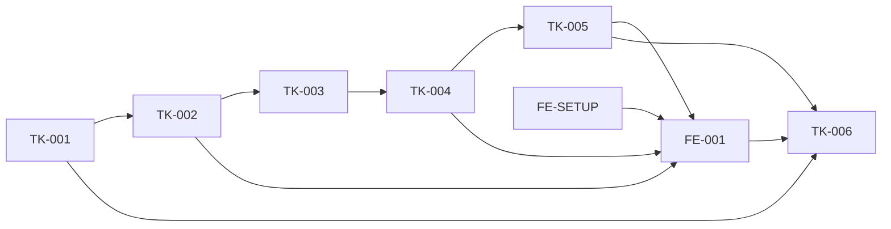

# DatasetFactory MVP — indeks ticketów

| ID | Tytuł | Status | Zależności | Gate |
|----|-------|--------|-------------|------|
| TK-001 | Fundament aplikacji i trwały workspace | wykonany | — | Gate 1 backend ✓ |
| FE-SETUP | Bootstrap systemu designu Impeccable | wykonany warunkowo | — | Gate 1; screenshot odroczony do Gate 3 |
| TK-002 | Profil gry i import lokalnego materiału | wykonany | TK-001 | Gate TK-002 ✓ |
| TK-003 | Media i eksperymentalny adapter OCR | wykonany | TK-001, TK-002 | Gate 2 techniczny ✓; quality FAIL→TD-014 |
| TK-004 | Trwały workflow, checkpointy i odzyskiwanie | wykonany | TK-003-F2 | Zintegrowany w `d4069bb`; finalny review `ACCEPT` |
| TK-005 | Weryfikacja anotacji i eksport COCO | gotowy | TK-004 | Gate 3 |
| FE-001 | Pionowy interfejs Home — Impeccable | gotowy | FE-SETUP, TK-002, TK-004, TK-005 | Gate 3 |
| TK-006 | E2E, hardening i uruchomienie jedną komendą | gotowy | wszystkie powyższe | Gate 4 |

Fixup `TK-001-F1` wykonany i ponownie zweryfikowany: 25/25 testów backendu,
15/15 frontendu, pełny lint/typecheck/build/audit bez ostrzeżeń.

Fixupy `TK-002-F1` i `TK-002-F2` wykonane; końcowy niezależny review zamknął
wszystkie findings. Pełny suite wykonawcy: 72/72; final targeted review: 18/18.

Rewizja OCR oraz `TK-003-F1/F2` wykonane: wydzielony `OcrEngine`, klasa `/`,
Tesseract wyłącznie jako adapter experimental, pinowane provenance, confinement,
model/language binding, `ocr-evaluator-v2` i manifest GT+cropów. Quality pozostaje
oczekiwanym FAIL, a docelowy engine pozostaje TD-014. TK-004 jest odblokowany,
ale musi przenosić `experimental=true` i `quality_gate=failed`.

## Graf zależności

TK-001 i FE-SETUP mogą powstać równolegle. Dalsza ścieżka backendowa jest
sekwencyjna; FE-001 zaczyna integrację po stabilizacji kontraktów.
